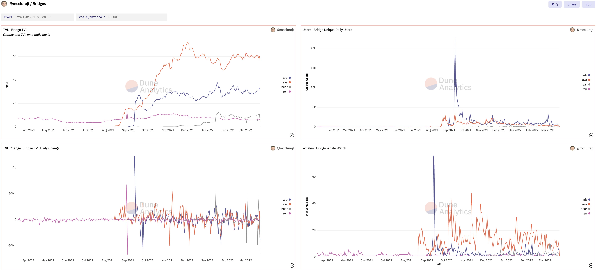
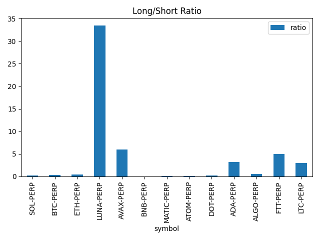

# Bridges / Dune Analytics

There have been multiple instances of bridges that have been used to help move assets and state from one ecosystem to another. We’d like you to create a small dashboard highlighting some of this activity. There are a few pointers that we could suggest, but please feel free to present this information as you see fit!

[Link to Dashboard](https://dune.xyz/mcclurejt/Bridges)

## 1. What core contracts would you use to track this kind of activity?

- If the bridge works as an escrow, one can simply check the balance of the bridge contract.

- If the bridge acts as an issuer, one can check the total supply of issued tokens. In practice (or at least in Dune) this is fairly costly as it requires aggregating all transactions over the life of the bridge.

## 2. Trends around volume/TVL, assets, bridging solutions, user activity, key contracts, highly used/in-demand contracts over a weekly period

- Trends appear to follow the overall market (assuming a bridge is "mature")

- Thought Process

  1. Look at TVL, see that some days had MASSIVE changes in TVL
  1. To better visualize, I plotted change in TVL per day.
  1. Noticed some odd stuff
     1. Arbi bootstrapping
     1. NEAR on 1/14, 03/03, 03/21
  1. To better understand what might be causing the massive changes I looked at unique daily users
  1. NEAR had surprisingly low amount of users, let's check how many unique wallets had tx's over 1million (Whale Watch)

- Takeaways

  1. AVA and Arbi have similar amount of unique users per day, however AVA has SIGNIFICANTLY more whale transactions.
     1. Higher institutional adoption of AVA, they've been heavily marketed as a defi haven
  1. NEAR has so few unique daily users that on some days ~33% of users are whales
     1. This query may not be accurate since Rainbow Bridge is no longer the only bridge
        - Allbridge connects NEAR with TERRA (29b TVL), possible that many people are using this bridge over Rainbow

- Further Research
  1. How was Arbi able to obtain such explosive adoption AND retain its userbase?
  1. NEAR lost 50% of its TVL for 24 hours on two occasions where other chain TVLs grew, why/how did this happen?
     1. What's the withdrawal process for the NEAR bridge look like?

## 3. If you were to move assets from one ecosystem to another, which kind of bridge solution/design would you use? There is some ambiguity in this question, but feel free to expound on your thoughts

- Escrow on local chain -> mint on remote chain

- Most common, but results in long withdrawal periods.

- Another option could be a cross-chain liquidity pool for tokens with different native chains
  - Wouldn't require burning/minting for each TX

## 4. What are the core issues you see with Dune Analytics as it relates to highlighting more information on this category?

- Individual bridge behavior must be understood and accounted for

  - EX: Arbitrum eth deposits and withdrawals are handled via internal transactions which requires looking at traces (internal transactions) and knowing the Inbox address

- Bridge events are non-standardized and commonly not helpful for assessing common metrics

  - EX: One would expect that the Arbitrum bridge would produce events like Deposit(user, amount, token) and Withdraw(user, amount, token) but it does not :(. Instead, transactions and traces must be used.

- Inbound bridges (Issuers EX: REN) require keeping track of the token total supply which is more costly than one might think (requires aggregating all transactions)

## 5. If you were to build out a product like Dune Analytics, what kind of architecture/software components would you use?

### Requirements

- Fast appends and reads

- Time-series focused queries

- Distributed data collection

- Latency should be less than ~1min from event to query

- MUST handle failover

- MUST not drop any metrics

When looking at these requirements, they seemed incredibly similar to that of a metrics pipeline!

### Architecture

Indexer - Prometheus?

- Watches the desired contracts / events via RPC. Temporarily records the data.

Relayer - Telegraf? Prometheus?

- Pulls data from multiple indexers

- Removes duplicate entries

- Pushes data to long-term storage

Storage - Time Series Database

- Ingests data from the relayer

- Runs continuous queries on insertion if needed

- Offers querying of the data

- Performs downsampling of old data

### Software

- Prometheus

  - Exposes data on a port that can be scraped

  - Can scrape other prometheus instances and expose their data

  - Advanced rules for cleaning data+labels

- Time Series Database ([InfluxDB](https://www.influxdata.com/) or similar)

  - Optimized for small, append-only insertions (blockchain data works similarly)

  - Native support for downsampling of older information

  - Supports compaction to turn write-optimized data into read-optimized data

  - Simple to use window and derivative functions (can be tricky/slow in SQL)

  - Continuous queries allow for updating aggregate values on every insertion. Would allow for the creation of aggregate buckets saving users a bunch of time compared to calculating themselves.

  - [Great article for further reading](https://www.alibabacloud.com/blog/a-comprehensive-analysis-of-open-source-time-series-databases-3_594732)

- Sharding

  - Should be sharded by time-range with multiple buckets present on a shard

  - When querying, the system could cache the relevant bucket data on the client's machine to avoid re-aggregating across many shards

- Other Thoughts

  - The underlying storage mechanism for InfluxDB is [Bolt](https://github.com/boltdb/bolt) which is a key/value database. Would it be possible to replace this with IPFS? Performance might be an issue but food for thought.

## 6. Given a chance to re-architect Dune Analytics (as per the issues seen), how would you go about doing it?

1. Use a TSDB with each bucket mapping to a Dune datatable. Use [Flux](https://docs.influxdata.com/influxdb/cloud/query-data/get-started/) or [PromQL](https://prometheus.io/docs/prometheus/latest/querying/basics/) to query.

1. Start out with a single centralized instance for simplicity and convenience.

1. As more data comes in and the platform matures, begin sharding the database. Possibly offer incentives for shard/node operators?

1. If the shard size becomes cumbersome, decrease the time range held per shard and downsample old data.

Food for thought:

- Users wanting to add data could run their own instance. Influxdb supports having other InfluxDB instances as inputs

# Solana indexing

Choose your favourite app on Solana ecosystem and present a small dashboard pertaining to this app

[Solana TX Reading](https://medium.com/@asmiller1989/solana-transactions-in-depth-1f7f7fe06ac2)

### Project

ORCA DEX

- Large DEX on Solana

- Supposedly catered to humans

Raydium DEX

- Other large DEX on Solana

### Indexer

- **[SolScan](https://public-api.solscan.io/docs/#/Account/get_account_transactions)** Indexer

  - Not graphql, but has great query UI / API

- **[SolanaFM:](https://solana.fm/explorer)** Indexer

  - Only one with a publicly available query interface

  - No app-specific indexing, gotta query raw tx's

  - Offers some helpers like `blocksCreatedInTimeRange` which make it more convenient than Dune

  - Unfortunately, it doesn't seem like their indexing is capable of checking SPL transfers for a given account without using code to convert/parse parts of a transaction. Not very convenient...

**Other Indexers**

- The Graph: Indexer

  - Many news articles say Solana is integrated, however I couldn't find any docs or subgraphs showing this

- Aleph.im: Indexer

  - No publicly available query interface afaik

## What kind of explorer/graphQL endpoint did you prefer to do this on and why?

SOLScan

- It has an available endpoint for querying SPL transfers for a given account.

- Since we know the account hashes of both DEX's SOL/USDC pools, getting all transfer amounts/directions is somewhat trivial

## Describe this project and justify what you feel are its most important metrics. Would also be great to highlight some of its metrics in comparison to other competitors

- Important metrics would be swap volume for a given time period, tvl increase/decrease for a given time period, volume of sol vs volume of usd received for a given time period

- Going to look at SOL/USDC since that's the pool with the highest TVL for both DEXs

## What are the main differences between indexers on Solana and Eth?

- ETH indexers mainly use events to provide per-project indexing, SOL indexers use transactions/accounts

- ETH contracts hold code and state, SOL programs only store code. SOL program state is stored in one or more data accounts

- Because of Solana's data storage structure (accounts), tracking down the correct account can be somewhat difficult.

- Without events, Solana indexers must perform significantly more parsing/decoding of transactions to uncover useful data

## Trends around user activity, actions taken over different time periods

- API Limits of SOLScan coupled with little storage on my laptop make aggregating data over weeks/months unfeasible.

- Will look at a single day and see if I can extract any useful info.

# Drift Protocol

Drift Protocol is building out a dynamic vAMM to help facilitate trading of perpetual instruments. Drift has put out their [Python SDK](https://github.com/drift-labs/driftpy) as part of their offering in order to help fetch data from the protocol

## 1. Play around with the SDK and see how you can set this up for efficient querying. Are there any limits that you notice as part of fetching data across calls? Feel free to express this as intuitively as possible

No examples, just a barebones api reference :'(

Luckily theres some docs for the Typescript sdk although the two sdk's are a bit different

- One limit is the fact that only 1024 items are returned with no opportunity for pagination. This means users are expected to index their own data if they want historical access

  - For historical trades, the window ends up being about an hour long
  - For historical funding rates, the window ends up being about one day long

- The funding rates returned are not equivalent to the funding rates shown on the website.
  - These must be calculated using the following formula: `100*( 1/24)*(row["mark_price_twap"]-row["oracle_price_twap"])/row["oracle_price_twap"]`

## 2. Build out a few graphs relating to funding rates, protocol revenues, and trading history

### Long/Short Ratio

### Cumulative Fees Generated

### Fee Generation Delta

### Fees by Market

### Funding Rates by Market

## 3. Any thoughts on how to expose this data - especially if you’d like to expose this to data analysts and create a data pipeline? What kind of setup would you have in mind for such a usecase?

- Keep the current offering for current calculations (or up to a day old)

- For older than a day, provide hourly aggregates of all statistics

- For older than a month, provide daily aggregates of all statistics

- For older than 6 months, provide weekly aggregates of all statistics

This could be done with any database capable of downsampling
